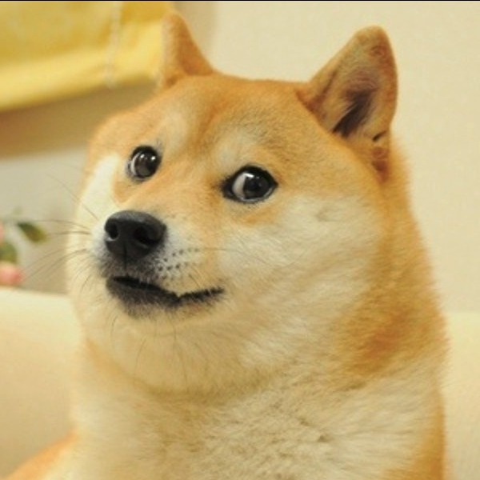
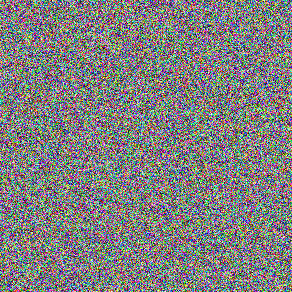

# bmp-encryption
Symmetric-key BMP image encryption algorithm. Also performs a chitest for both input and output and prints it to the console.

## INSTALLATION
```bash
gcc -o executable app.c
```

## USAGE
```bash
./executable [enc/dec] [sourcePath] [destinationPath] [keyPath]
```

**enc** - encode file  
**dec** - decode file  
**sourcePath** - path to image  
**destinationPath** - path to output  
**keyPath** - path to key.txt (must contain 2 unsigned 32bit integers separated by a space)

## EXAMPLE

**doge:**  
  

**doge after encryption:**  
```bash
./a.out enc doge.bmp dogeEnc.bmp key.txt 
before: R: 1049538.812233 G: 739433.472262 B: 374238.833570
after: R: 272.435277 G: 261.401138 B: 233.044097
```


**doge after decryption:**  
```bash
./a.out dec dogeEnc.bmp dogeDec.bmp key.txt 
before: R: 272.435277 G: 261.401138 B: 233.044097
after: R: 1049538.812233 G: 739433.472262 B: 374238.833570
```


## HOW IT WORKS
This algorithm only encrypts the pixels of an image, leaving everything else unchanged.  
* First, a permutation is generated using the [Fisher-Yates Shuffle](https://en.wikipedia.org/wiki/Fisher%E2%80%93Yates_shuffle) using multiple [xorshifts](https://en.wikipedia.org/wiki/Xorshift) on keyR; after which the pixels are then permuted according to it.  
* The pixels are then recursively encoded using keyR and keySV as seeds for differend operations.  
* Decryption is achieved using the above steps in reverse.

One might wonder: **Why in the world would you only encrypt the pixels and not the whole image, maybe even bit by bit?**  
*Good question...*
